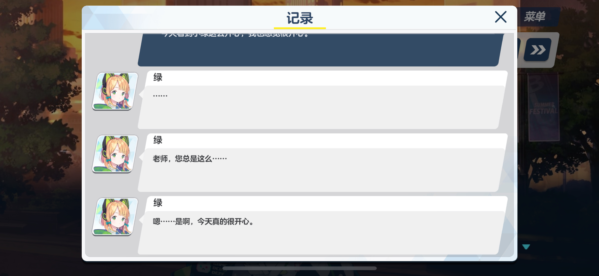

# “卑一个字，不及她的万分之一”

!!! info "重要信息"
    本文章经原作者授权转载，KFACBT 校对，版权归原作者所有。

    原作者：[**正妻的事怎么能叫卑呢**](https://space.bilibili.com/1759673869) 
    来源： <https://www.bilibili.com/opus/1003237672403075081>

!!! note "提示"
    按下 ++ctrl+f++ 或单击页面顶部的搜索图标即可快速查找页面上的内容。

“才羽绿”的好感剧情详解，立绘与细节的赏析，完整人设的一万八千字表述。

> 这篇文章由几个部分组成：
> 1. 人物分析方法的介绍
> 2. 小绿身上的一些细节及好感剧情分析 
> 3. 小绿各个层级的心理特质的表述 
> 4. 用心理特质对行为支配的变化来解释好感剧情中的行为，借以看清绿在好感剧情中的变化

（放只小绿）

---

## ①: 人物分析方法的介绍：

1. 人物的心理有不同层级，由内核向外发展
2. 不同的心理特质可相互影响，产生新的特征 
3. 分析的第一追求是整体的和谐，并在和谐的基础上追求简洁 

我们先从台词和剧情中得到经验，从经验中我们可以得出猜测。虽然一句话是多种心理因素共同作用的结果，但单从一段经验中无法深究背后的原因。我们把多段经验放到一起，把从单段经验得到的猜测与其他经验作比较。对于单段经验，因为获得的信息太少，我们的猜测就会非常自由。但只要追加更多经验与推测，对合理的猜测的限定就会越来越多，我们把经验与猜测相互印证，以找出猜测间的重叠部分。这时我们就可以承认这些重叠部分是合理的，我们创造了一个和谐的理论。

理论就是这个人物的心理特质。当一个理论无法解释所有的经验时（这是必然的，不然人物模型就会像个木偶人），我们要引入更多的理论。每个理论都要经历这样的相互验证，各个理论之间也要寻找联系，丰富我们的总理论。 我们从初级经验（她说了什么，做了什么）得到感性认识（有表现欲，有依赖性）从感性认知中寻找共性，找出为什么她会有这样的表现，得出她的心理特征，并再次寻找心理特征间的共性，同时探究心理特征相互作用与发展的关系，探索不同心理间的层级，不同性格特征其冲突时他会选择哪一个，心理特质衍生发展的原因。在这几点基础上，我们再次寻找共同点，进行概括，找到“心理内核”，这个内核要以最简洁的核心，概括人物最深层的心理，内核是发展出所有心理特质以及他的所有表现的原因，是衍生出人物所有心理特质的母体。

内核应该有好几个，并且没有部分是多余的，可以完美的解释人物所有的行为。假如这几个内核少了任何一个，人物的行为会发生很大的改变。 建立起这样一个模型后，我们应该更深层次的去挖掘心理特质间的层级关系，这个特质是由哪几个特质共同发展得到的，冲突的特征中哪个占上风。并把这个模型放入想象的情境中，观察互动是否自然，我们不断假设、理解、演绎和推翻，在此基础上得到发展。直到达到整体上的简洁、和谐和准确。在互动中不断理解，总结，丰富，以达到更完善的人格。

首先我们可以把人物的台词和剧情抄录在纸上，不断挖掘小细节，在一段台词或一段剧情的基础上进行猜测，然后在其他台词或句型中寻找与之验证的地方。不断推翻你的模型，不断寻找经验间的联系，不断进行修改，想象她会做什么事，会说什么话，让这个模型的活动越来越合理。从台词中寻找共性，向上感知得到感性认知。从感性认识中寻找共性，向上概括形成很多种心理特征。把心理特征高度概括，得到内核。闲着没事就在脑海里把亲密剧情过一遍，品味一下她的台词，这样既可以挖出细节，也可以有更多大局上的感性认知。

       

---

## ②: 小绿身上的细节和好感剧情的赏析

> 小绿的生日为什么是 12 月 8 日？

这个问题曾经令我百思不得其解。好像没有什么特别的意义吧？最后我得出这样的结论。

但后来我想到：

128 可以分解为两个 64, 64 等于 8 的平方，这两个 64 不就像两个双胞胎？

而 64 又能分解成很多个二，不就展现了小绿和小桃性格的细腻性和对立性？

在毕达哥拉斯学派中，128 属于未完成数，象征着“不完美”和“差异”。在这里可以指代双胞胎身份和性格的差异和内心对理解和关怀的需求，“正因为不完美，所以才需要爱。”

> 再者，小绿和小桃，原版立绘为什么方向一个向右一个向左？

老版 2D 游戏中，玩家操控的人物向左代表后退，向右代表前进。

而认识了新的角色，假如一开始脸朝左边（像小桃那样）代表面对主角，

脸朝右边（像小绿那样）就有隐藏感与羞涩的感觉（代表了好感剧情中隐藏自己的幼稚）。

在西方传统绘画中（小绿也是画师），向右代表了“逃避”和“未完成”，代表了在四篇好感剧情中“对幼稚自我的逃避”和“逃避之后等待着认可和理解的情结。”

而 Live2D 中脸反而向左了，在影视作品中，代表了人物开始直面观众，这里则代表了不再隐藏自己的幼稚，而是愿意在老师面前表现自己的幼稚。

再者，为了体现人物的幼态感，额头要露在玩家面前。刘海朝向左边，就代表着小绿用左手撩刘海，而不是常人惯用的右手。撩刘海时把非惯用手暴露在别人面前，显得羞涩内向。东方美学中“不自然的动作”代表了含蓄美，侧面体现了小绿拘谨的性格和细腻的内心。

常服立绘

<!-- 此处貌似不应该使用 Blockquote...? -->

<!-- > 小绿的立绘给人一种微微侧脸回眸的感觉，一方面暗示了好感剧情中心态的转化，另一方面从她的眼神中可以看出：疑惑，期待，认真，又给人一种很宁静很安心的气氛。她站在那里，就好像在说：“有什么事吗？”这种话。 -->

小绿的立绘给人一种微微侧脸回眸的感觉，一方面暗示了好感剧情中心态的转化，另一方面从她的眼神中可以看出：疑惑，期待，认真，又给人一种很宁静很安心的气氛。她站在那里，就好像在说：“有什么事吗？”这种话。

小绿的外套很大，手掌被袖子盖住了一点，右手托着很大的狙击步枪，手臂弯曲，让枪托靠在手肘上，显得比较吃力。左手却又把枪口往上托，明明很重啊！

很多人都注意到了小桃的立绘是动态的（头发飘起）而小绿的立绘是静态的，可是这种静态貌似是提前摆好姿势的。小绿努力地把很重的枪托起，静静的站在那里，好像想在老师面前展现自己的文静和能干之类的…… 怎么会这么可爱！

> 为什么绿穿的是短裤？

因为外套过大已经形成了一个下摆，如果再穿裙子就显得活泼了（小桃）。穿短裤则会有一种清爽感，同时也体现了腿的修长，与她稳重细心的性格更匹配。并且，外套最上面的几个扣子没有扣好，露出完整的领带，加上外套下摆和纤弱的腿，形成了纤弱又挺拔的站姿。

> 小绿的大厅语音有一句“啊，老师也玩过我们的游戏吧？您觉得哪些地方最有意思呢？”

在主线剧情中，柚子发布的原型被骂了，桃制作的完整版的剧情也被骂了，可是貌似没有针对小绿负责的插画的差评。这句话看似是无意义的闲聊，实则是期待受到表扬。

这时候就该说：“美术是你们的游戏中最好的部分。”这样夸奖她。

> 为什么小绿的主色调是绿色？

一方面，绿色是一种柔和的颜色，同时又充满生命力，符合小绿温柔又积极向上的性格。

另一方面，尽管在常人看来，绿色是一种不起眼的颜色，但是猫对绿色是最敏感的。这也符合小绿虽然有着不起眼的气质，但实际上渴望别人关注的性格。

在歌德《色彩论》中，绿色是对立（黄色和蓝色）的平衡，是平衡和宁静的象征。暗示了小绿好感剧情的末尾达成了“幼稚和理想自我的对立之后的平衡”。

---

### 好感剧情赏析：

#### 《是截稿日哦，老师》

小绿由于没有灵感，而又不愿意因为自己的原因而拖稿，找老师来帮忙。老师建议玩其它的游戏转换心情，小绿一直输，红温了，拉着老师打了一晚上的游戏。冷静下来后道歉。

“如果因为自己的原因而拖延的话，那也太不负责任了吧！”在好感故事的开头，小绿这样拒绝了老师拖稿的建议。

她的积极，加上由于“敏感”对于责任这种宏大词汇的向往，所以找老师来帮忙。

奇怪？她不是想装作成熟吗？为什么要向别人求助，显出自己的软弱呢？

从这里可以看出两点：

1. 小绿不只是想装作成熟，而是真的身体力行的想让自己看上去成熟。

    比起好强这种幼稚的想法，“想要成长”这种积极的想法才是她这种行为的动机。在她的心目中，宁愿暴露自己的软弱，也不愿意因自己的过错而耽误团队研发游戏的进度。

2. 小绿对老师有敬仰的想法。

    大家试着把自己带入到小绿的视角吧：来了一个听说很厉害的老师，是个大人，之前从来没见到过。以她浪漫的“敏感”，肯定会产生一些向往（不是爱情，而是想要和这种大人一样）和敬仰的情绪（对成长的期待），再加上她的“幼稚”，在这里就已经开始产生一些依赖了。

接下来她的幼稚又压倒了她的积极，“浪费”了一个晚上的时间。综上我们可以得出支配小绿行为的心理特质优先级：

应注意的是，小绿在前两个剧情中并没有对老师产生什么男女之间的感情，这个将在下一个剧情中具体分析。

---

#### 《是画展哦，老师》

小绿为一起看画展的老师准备了便当，但因为看得太兴奋了而忘了交给他。最后在夕阳下二人对话，剧情结束。

从小绿这么激动地看画可以看出：

1. 她真心热爱着绘画，小绿既是一个稳重好强的学生，也是一个情感丰富，善于观察和体会美丽的事物的孩子。
2. 小绿后来对待情感一直很认真，但这里却把老师丢下了。从这里可以看出，小绿这时还没喜欢上老师。

是的，小绿在前两个剧情中并没产生什么特殊的感情。

我们想想她在前两个剧情中的“亲密举动”

1. 求助制作游戏。这个在刚才已经分析过，是由于敬仰的情绪。

2. 拉着玩了一晚上的游戏。这个很明显就是玩游戏输不起吧？（幼稚）

    小绿的好感剧情是有配音的（高田忧希！）好感剧情前的 MomoTalk 也有配音 [^1]，并且这些 MomoTalk 是模拟了小绿的情绪的。仿佛为了证明这一点，在开头约老师出来玩的时候，有模拟出小绿想掩饰自己好感的感觉。但小绿在结尾的 MomoTalk 中道歉的消息，却听起来非常真挚，没有掩饰的感觉。

    [^1]: 哔哩哔哩(搬运): <https://www.bilibili.com/video/BV1Ci4y1q7wF/>
          YouTube(原视频，带有空降): <https://www.youtube.com/live/dqsHbNAVWus?si=AaMAvVpFBX2Y1Shc&t=9495>

    由此可见，这件事是真的太幼稚而不能保持冷静导致的，而不是什么心机之类的东西。

3. 做便当。

    我们在前面已经论证了，绿是个非常积极进取的孩子。在绿的性格特征中，稳重和严于律己占了很大比例。

    在第一个剧情中，她就说过：由于自己的原因而耽误了别人的，那也太不负责任了吧！（结果最后反而耽误了老师一晚上的时间）。

    做便当应该是由以下三种情绪支配她而出现的行为：

    1. 内疚，嘴上说着“耽误别人不负责任”却占用了一晚上时间的“歉意”；
    2. 好强，展现自己的想法、并弥补之前稳重的形象。希望在别人面前展现出稳重可靠的性格，希望自己的“成熟”能得到“敬仰的大人”的认可；
    3. 欣喜，这是潜意识中的幼稚得到满足的结果。但现在并不能直接得出这个结论，要从后面两个好感故事的结论回来反推。

    综上，好强展现自己，加上占有时间的歉意，以及潜意识体谅幼稚的欣喜，所以做了便当。

所以我们看出，前两个剧情中她的行为，根本没有什么特殊的好感在里面。但是好感故事二的结尾，就会产生这种好感了：

由于看到了自己一直追求的“浪漫”（游戏画展中的“美”），让小绿情绪激动。这时，幼稚的一面就显露了出来，让她自控力下降。

所以小绿“像小孩子一样只顾着自己开心”，把老师忘在一边，连“自己做的便当和乌龙茶”都忘了给老师。

一天结束后，小绿在夕阳下清醒过来，自责地向老师道歉。这样美丽的夕阳下（暖色调具有扩展性），在印象派光影中常用来烘托情感的质变。

一直想遮掩自己的幼稚的她，为此尴尬不已。小绿应该是这么想的：

“之前我都已经显得那么任性了，浪费了老师一晚上的时间。原本今天想给老师留下好印象的，可是居然只顾着自己开心，老师对这些肯定没有兴趣吧？这样一来，我在他心中的形象就更差了…… ”

但是，老师是这么说的：

这种话，出乎自责的她的意料。

这不是责备，而是体谅。看到了她的努力，体会到了她为之激动的“美丽的东西”。

我们想一想，之前有人看到过小绿的努力，迁就过她的幼稚吗？

没有吧。

维持稳重形象消耗需要心理资源，这是一种情绪劳动。（Hochschild 情绪劳动理论）

但是小绿还是一直在努力。努力隐藏自己的幼稚，努力在别人面前显得成熟稳重，努力把一切都做到“最好”。

默默的努力，希望有人能领会。

在冷静稳重的外表下，是幼稚的一面，虽然无法宣之于口，但潜意识里仍希望有人能包容她的幼稚。

而老师“觉得很有意思哦”，就原谅了她的幼稚。“看来小绿真的很喜欢复古游戏呢”，老师看到了她的敏感，她所重视的美。

惊讶的她，不经意脱口而出，就这样敞开了自己的心扉。

这一段对话，是我喜欢小绿的开始。

来分析一下吧：

1. “之前我刚接触复古游戏时还会想，为什么大家会喜欢这样的游戏呢？”

    1. 第一层含义：

        这句话透露出，小绿发现别人的想法和自己不一样时，会努力去理解别人的行为，揣摩别人的心理。

        根据小绿对于“美”的追求，还有小绿的这句话，我们可以猜测：小绿会寻找“共情”，小绿是个情感丰富的孩子，拥有同情心。

        这一点将在下一个好感故事之中得到验证。

    2. 第二层含义：

        分享自己喜欢上游戏的过程。

        小绿分享了一件对于自己的人生重要的转变，表现了心理上的接近。

    3. 第三层含义：

        我们试着还原一下当时的气氛。

        二人相伴的时间结束了，夕阳洒在我们所站立的广场上。这时，原本自责的小绿得到了出乎意料的体谅。前几天，她的“无理取闹”也受到了包容，可能小绿心里，也有一点再次受到理解的期待吧，但是应该也会自嘲一下自己幼稚的期待。

        这里的“游戏”，是不是可以理解为“像小孩子一样撒娇”呢？

        “之前我就一直在想，为什么大家会喜欢这样的游戏呢。”

        以前活泼快乐的大家旁边，是冷静的站在一边的小绿。一方面，虽然心里可能也有一点期待，但主要的，可能还是她真的不理解，像小孩子一样撒娇有什么意思。

        可能这么似乎有牵强？小绿一直是个很认真的孩子，她所表现出来的行为，必然接受过她认真的考虑。小绿一直在别人面前显得冷静慎重，证明她认为这样是“正确的”，也就是她没有认识到“幼稚有什么好的”。这也可以佐证上面那点：她对不隐藏自己幼稚的大家感到疑惑。这时又可以再次论证上面那一点：她会去揣摩别人的心。

        “这种游戏”，在这里应该就是代表“放弃了好强的撒娇”。

        “之前我还在想”的言外之意就是“我现在理解了。”

        小绿理解了这样的撒娇，却又受到别人体谅的感觉，真的很不错：之前拉着老师玩了一晚上的游戏是这样，今天只顾着自己开心而拉着老师跑了一天也是这样。

        所以，“我慢慢地也喜欢上了这种游戏”

2. “后来，我慢慢地也喜欢上了这种游戏”

    1. 第一层含义：

        “喜欢上了这种游戏”，照应前面的“这种游戏指的是放下好强的撒娇”。

        为什么小绿要在夕阳下说这种话呢？二人共度一天之后，没有回顾一天的美好之处，为什么反而要说“我喜欢上了一种游戏”呢？这么说不是显得有些意义不明吗？

        这句话就是对这一天的总结。

        “喜欢上了这种游戏”就是暗喻了这一天之内小绿心理的转变。

        即使在他人面前得显得冷静慎重，在老师面前幼稚地撒娇，也不是不可以。

        这显得私密而亲近。

    2. 第二层含义：

        “慢慢地”感叹了自己变化的曲折，听到这个词，好像在回顾不断的接受和包容——这就是真诚的感谢。

    3. 第三层含义：

        回顾一下之前的剧情（P1），小绿由于没有灵感而向老师求助，老师当时是这么说的

        “我们不妨换个游戏吧。”

        在那个情境下，小绿是由于太急切，脑子乱了才没有灵感。

        而在平时，小绿是由于太想在别人面前表露出成熟的一面，所以会搞砸一些事情。

        这两者是不是有相似之处呢？

        “换个游戏”在那是针对没有灵感的建议，但或许也可以理解为对小绿本身的建议。

        小绿曾经在最后一个好感故事说过，“之前对除了像素风之外的游戏都没有兴趣”，从这里可以看出小绿是个比较守旧的人。

        在生活中，小绿一直坚持的游戏，就是“在所有人面前显得成熟稳重。”

        老师教给她的游戏则是：

        “不妨在我面前也撒撒娇”

        所以：“我们不妨换个游戏吧”

        “我慢慢地也喜欢上了这种游戏”

        后者，是对前者的回答。

    4. 第四层含义：

        虽然现在还看不出来，但是当我们分析完所有好感故事会发现，这句话是对小绿所有好感剧情的概括。

        也就是“慢慢地喜欢上撒娇的游戏。”

3. “这其中也有很多我至今仍没明白的游戏。”

    “比如说那个登上冰山的游戏吧？为什么超出画面就会死掉呢？（哭）就不能等一下吗？”

    1. 第一层含义：

        指今天像小孩子一样的表现。

        小绿说的这个游戏，就是悄不注意，就会失败的游戏。（为什么超出画面就会死掉呢）

        就像今天她的表现一样。

        即使受到了包容，她仍会感到一点遗憾（就不能等一下吗），不能完全原谅自己（至今都还没明白规则）。

    2. 第二层含义：

        分享自己对游戏的体会。

        分享自己生活中的喜悲，表现了小绿与老师心理距离的接近。

综合上面三段话：

小绿分享了自己的人生经历，也就是在渴望了解和交融。

小绿分享了自己的成长，也就是在寻求理解和陪伴。

在这一刻，小绿对老师的情感发生了质变，敬仰变成了喜爱，“想在他面前表露出成熟的一面”变成了“想在他面前表露出幼稚的一面。”

小绿意识到，在夕阳下的这个人面前，她即使无理取闹，即使出了差错，他仍会温柔的体谅她的幼稚，看见她的努力，体会她所追求的美。

才羽绿，在这一刻喜欢上了老师。

而当时的我，虽然并不能清楚的理解她话语中的含义，却也是从绿在夕阳下惊讶的睁大眼睛开始，才喜欢上才羽绿的。

小绿，真的那么机敏？在那么短的时间里，她能准确地想出这些话的含义并说出来？

我认为不是的。当时的我和她，都不理解这些话的含义。

艺术是什么呢？有些作品，我们一看就觉得很美，但是我们一定知道是什么让它显得美吗？有些诗人一挥佳作，他们当时就知道，是什么让他们的诗显得美吗？

艺术家，拥有对复杂的情感快速的概括能力。

是有东西让这些作品显得美丽，但这些东西却不必被直接观察到，这就是艺术。

小绿敏感的心灵快速地概括了自己心中复杂的情感，说出了这段话。

绘画，可以从构图等慢慢分析其中的构思，但人们不必知道这些，只要看见就能觉得美。

夕阳下的我们，都不知道这句话中到底蕴藏着怎样的深意，但我们，都体会到了这其中满溢的情感。

才羽绿不知道为什么要这么说，但她知道应该怎么说。这就是小绿对复杂的情感快速的概括能力，只不过绘画是用色彩表示出来，而此刻，她用言语直接向我传达。

“看到小绿今天这么开心，我也就很开心了”

这不仅是系统给我的机械的没有选择的回答，也是我真心想对她说的。

这句话在这里没说完，但是后来小绿完整的说了出来：“老师总是这么温柔。”

上面几句话中蕴含着怎样的情感呢：

因为“老师一直这么温柔”的歉意与谢意，

“今天很开心哦”的欣喜，

所以小绿说“下次再和我一起出来玩吧”，

其中蕴含着对未来的期待。

小绿特别强调“今天”，因为在她心目中，这是一个特别的日子。这里表现的小绿对“意义”的追求，这一点在以后的好感故事中还将反复出现。

即赋时间以意义，赋物件以情感。

---

#### 《是首发限量款哦，老师》

绿发来桃信时说：

“急报！急报！”

在这里，小绿的口气明显变得幼稚了，照应了上篇好感故事的结尾小绿的转变。

小绿和老师去买首发限量款游戏，因为已经提前卖完，她慌张地拉着老师找了很久才找到了一家小店中的最后一盒。

小绿带着激动兴奋的表情说：“终于找到了，最后一盒！…… ”可是这时，一个小女孩也来到了这里。

小绿对老师笑着说：“老师，我们走吧。”

“可是，小绿也已经找了很久啊。”

绿笑着说：“游戏，也是要大家一起玩才好玩的。所以，我没关系的，老师。”

小绿想起了，那个刚接触游戏时，不知道“大家为什么会喜欢这种游戏”的自己。

她希望更多人能体会这种她所热爱的美，在这里，小绿展现出了强烈的共情性和同情心。

话说回来，约会时买游戏，不是很奇怪吗？

我们来分析一下前三篇好感故事中小绿的目的：

1. 向敬仰的人寻求帮助。
2. 表达谢意并表现自己。
3. 去早就已经找好的地方买游戏。

那么第三篇好感故事中，小绿是怀着怎样的情感制定了这个计划呢？

小绿对游戏倾注了喜爱，这是希望老师也能够理解她所理解的美好，希望能够一起去得到她认为重要的东西！

这和前面两篇好感的故事中的“寻求帮助”“表现自己”已经不同了，第二个好感故事的结尾，小绿的情感确实发生了质变。

这里体现出了：

1. 分享欲：向爱人分享自己所爱的东西，希望爱人也能体会这种美好。

    <strong style="text-align: center; font-size: 1rem;">所以说，“寻找游戏”和“让出游戏”的目的是一样的，都是分享自己所爱的东西，希望别人也能领会到自己所领会的“美”！</strong>

2. 陪伴欲：希望和爱人相伴，获取她认为重要的东西。这个事件被她赋予了重要的意义。

    一方面，和爱人相伴，是小绿显露出幼稚的一面的“撒娇”。

    另一方面，和爱人去获取重要的东西，体现了小绿的“积极向上”。

    这一点在小绿的语音集中也有体现：

    “有时候我会想，身边有这样一个能时刻给我元气的人，真的是太好了！”

---

但是在让出游戏的同时，小绿心里也想着：

“虽然嘴上这么说，但…… 实际上真的很想玩啊！（哭脸）”

这背后是她内心的矛盾，即“幼稚”的自私和“敏感”的同情之间的冲突。她为之那么激动期待的游戏，想与喜欢的人一同领会其美丽的那么喜爱的东西，却能因为只是“不忍心让可爱的孩子失望”而放弃。

小绿心里仍很幼稚，她却能克服这种幼稚，牺牲自己，所以她的同情显得更加珍贵。

第二天，老师来到了游戏开发部。

小绿睁大眼睛说：“啊，老师找我有什么事吗？”

老师递给了他一盒东西。绿惊喜地说：“是塞尔纳传说！首发限量版…… ”开心地笑了。她此时的笑，是那种脸上带着红晕，半睁着眼睛幸福欣慰的笑；也是那种欢呼雀跃，让人一眼就能望到内心深处的喜悦的痴笑。

这种真挚的表情，更加衬托出了之前她放弃的不易。老师和小绿都一样：“不忍心让那么可爱的女孩子失望。”

然后，小绿又静静地望着老师，脸上的红晕与绿色的双眼相映衬，说：“啊，老师怎么会有这个的？”老师说：“适当的熬夜，也是大人的特权哦。”意思是说，我在街上熬夜找了很久才买到的。这里说自己是大人，言下之意是小绿是孩子，满足了小绿的依赖。

小绿闭上眼睛，在心里默念道：“…为了我”

“这就是，会熬夜的大人！”

在这里，小绿应该开心才对啊，为什么她会露出这样的表情呢？

这里和第二个好感故事的结尾的表情是一样的，所表达的情感也是一样的。都是对自己幼稚的抱歉和羞涩，也有着真诚的感谢和增长的感情。

一瞬间，她睁开眼睛，红晕布满双颊，幸福的笑着说：“谢谢你，老师，我非常喜欢你的礼物！”

小绿笑得更灿烂了：“真的非常感谢！”

小绿所在意的不只是这个游戏，更令她在意的是“为了我”。在这里，她把这个游戏寄托了深沉的情感，这种移情倾向再次出现。

---

#### 《是重要的回忆哦，老师》

小绿和老师去了游戏厅。

“听说，游戏厅里有很多可怕的家伙呢…… ”

“小绿，抱着先入为主的观念而不去尝试可不行哦…… 一起去游戏厅吧？”

“欸…… ？！
那么请务必！”

老师在这里暗示小绿：不能抱着先入为主的观念看待事物，如果不去尝试，就永远不会知道是否真的是那样。

“游戏厅”是“未知的地方”

那里有“可怕的人”，但如果不去主动展现自己的内心，就永远无法享受到幸福。

“他人的心”也正是这样一个地方。

但是，绿会害怕的。

自己不够负责任，

自己会给别人添麻烦，

自己太幼稚了，

自己的梦想和爱不会被理解。

所以，我会陪在你身边。

“当你第一次去尝试时，我会陪在你身边的。”

“…… 一起去游戏厅吧？”

“…… 请务必！”

       

才羽绿一直因为未知的可能性而不去尝试，所以她只是因为害怕失败、害怕计划之外的变化就从不展现真正的自己，向他人表示自己的真心。之前的她总是避免社交，安静地站在姐姐身后。不露任何破绽，同时也拘束着自己。

虽然小绿是第一次来这里，却在一个娃娃机里看到了一个熟悉的角色“弹弹果冻”。

她兴奋又幸福地笑着说：“那是…… 弹弹果冻！为什么会在那里面呢？”

“难道是被抓进去的？”

“游戏开发部，有一个代代相传的传说，在一个古老的游戏中，玩家要扮演一个外星人，把无辜的动物从农场里抓走！”

以上剧情应注意两点：

1. 在这里小绿显得很兴奋，这是因为第一次，也是和喜欢的人一起来游戏中心，有着特殊的意义。
2. 因为这种兴奋，小绿在这里显得特别幼稚！看看她说的都是什么话啊，讲出这种不可能的猜测（游戏机里的玩偶是被抓进去的），说出这种与约会八竿子打不着的传说。和刚开始那个正经的小绿完全不同吧？

这时她内心丰富的想象和兴奋的心情已经不再隐藏了，小绿表现出了自己的幼稚，也表现出了对于老师的依赖和信任。

“小绿，要不要试一下？”

“我…… 我吗？做得到吗…… ”

“只要尝试的话，总会有一点收获吧。”

“…… （笑）那么，我就试试…… ”

老师鼓励勇于尝试，符合她积极向上的天性，所以小绿笑得很惊喜。

在这个好感故事以后，小绿也一直勇于表达自己的情感。

于是，小绿去抓了娃娃。

她说：“在以前，除了像素游戏之外的游戏，我都不大感兴趣。没想到，在这里还有这样的游戏啊！”

这篇，是小绿的好感故事的结尾。“在以前对其他的游戏都不大感兴趣，原来这里却还有这样的游戏。”

就像之前说的那样，之前小绿执着于“扮演成熟稳重的大人”的游戏，老师却教会了她“可以在我面前撒娇哦”这样她之前一直没发现的游戏。这个“原来”之中，蕴含着深深的喜悦和感谢，也是对全四篇好感故事的回收。

她又笑着说：“真的非常非常感谢你，老师。今天和我一起来这里，我真的很开心！”

这两句话不仅是说在游戏厅找到弹弹果冻的惊喜，也是对老师一直温柔地陪着她的感谢，表达了“因为是老师带着我的啊”这样的爱意。

“啊，对了…… 今天的事，能不能对姐姐保密啊！…… 绝对！绝对要保密！”

为什么要保密？三个原因：

1. 首先，小绿其实是个很羞涩的孩子。每次表达情感，总要掩盖一下（比如“今天好像是恋人的节日呢…… 我，只是说说而已！”）。
2. 其次，小绿喜欢追求“意义”。和喜欢的人一起去买游戏是这样，和喜欢的人第一次来到游戏厅也是这样…… 共同的秘密对于恋人来说，有着特殊的含义。“这一天，是独属我们二人的美好。”其中，也有一些好强使然的“独占恋人”的欲望。
3. 第三，注意小绿的口气！之前的她可一直都是很礼貌的，这里却用了语气强烈的祈使句！这再次验证了我一直说的，小绿在老师面前不断开放自己像小孩子一样的内心，在这一刻，在四篇好感故事的末尾，她终于学会了“像小孩子一样撒娇！”小孩子也是喜欢保密的啊（不要和别人说好不好？）

那么，现在来鉴赏小绿的 Live2D。

首先，在一分钟的时间中，小绿变了五六种表情，这表现得她的幼稚和兴奋。即使表情如此丰富，小绿的双手却一直放在娃娃机面板上。

再回顾一下之前说过的（2D 游戏中面向右代表背对玩家，面向左代表面对玩家角色）。在勒温心理场域理论中，这代表的是心理上的接近和依恋。

这里，小绿脸的朝向由立绘的面向右变成了面向左，在这个好感故事的结尾，这代表了：

“这四篇好感故事是一个转身的故事，从背对老师的封闭内心到面对老师的坦然接受的故事。”

从这样初见时（面向右）

变成此刻（面向左）

第一点，小绿虽然表情变化丰富，但双手一直放在娃娃机面板上，展现了小绿的信赖。

第二点，小绿的站姿由面向右变成了面向左。

第三点，枪没有自己背着，而是放下来靠在了娃娃机旁边，体现了小绿第一次抓娃娃时的认真和兴奋。“放下武器”代表了她放下了内心对幼稚自我的否认后的轻松。

所以说，小绿的 Live2D 的肢体语言较为开放，侧面体现了她心理的变化。以绿黄色调为主，充满生机、温暖和幸福。

“老师，是截止日”：绿的好强不是在别人面前看上去成熟，而是真正变得成熟。

“老师，是重要的回忆”：绿的成长不是学习面对他人的眼光，而是学会面对自己。

       

抓到娃娃后，小绿惊喜到有点傻地说：“啊，老，老师！我抓到了！”

”这个，这个怎么办！“

“这个是给胜利者的奖品哦。”

…… 小绿闭上眼睛。

又睁开。

“以后每次看到这个玩偶时，我应该都会想起老师吧。”

“谢谢你，老师。…… 这个玩偶，我会好好珍藏的。”

在这里，小绿的“移情性”让她把对老师的情感寄托在了这个玩偶上。

不管是哪一个绿厨，耗费大量资源所造出来的，在逐渐累积至一百级好感的日常中一一一贯彻到底的物品，

就是这个果冻形状的抱枕。

从那个下午以后，咖啡厅里的小绿喜欢的礼物，就一直是这个抱枕。

---

#### 情人节：《老师，我想成为第一个》

2 月 14 日，小绿早早地把老师约了出来，自己却迟到了。小绿到达约定的地点后，急的都哭出来了。

绿给自己打气：

“不能再犹豫了：之前练习了这么久，不就是为了这一刻吗…… ”

那天在画展，绿也说过差不多的话：

“犹豫的话 原本能克服的也克服不了…… ”

Midori 能够意识到自己的不足，力求进步：她的好强不是逃避自己的缺点，而是这种较真的精神。

“之所以叫老师出来，是因为这个…… ”

“我，我想比任何人都早。我想要，成为第一个…… ”

“（哭脸）没，没什么！总之，总之这个应该是能吃的！吃完以后一定要通过发信息告诉我感想，我先走了！”

这里应注意这几点：

第一，由于表现欲，想在老师面前留下更加深刻的印象，所以小绿才约老师这么早出来。

第二，小绿迟到是由于前一天晚上制作巧克力，直到深夜才做好。小绿是个追求完美的学生，却知道昨天晚上才做好，我都不敢想小绿试错过多少次。

第三，这个巧克力和之前的抱枕一样，由于移情性都寄托了 Midori 的情感。

第四，小绿的情感中也有好强的成分，所以她才想要“比任何人都早”。

第五，小绿追求特殊的浪漫的意义，所以她才会“自己制作”，“想成为第一个”。

小绿的慌乱有三个原因：

1. 幼稚的她本来就容易慌乱。
2. 迟到打破了小绿精心营造的浪漫感。
3. 迟到与小绿的责任感相违背，而且老师是比任何人都要特殊的人。

小绿即使已经为了老师熬夜制作巧克力，为了给老师留下更深刻的印象，在自己已经熬夜的情况下还约老师这么早出来。她真的是个很努力，也很认真的学生。

       

---

## ③: 小绿各个层级心理特质的表述

### 三个内核：最本质的特征，由此发展出一切

#### 积极：三内核中最明显的一个特征

小绿的积极不是什么乐天派的活泼，而是认真的做好每一件事：

* “我会努力做到最好”
* “今天我也会全力以赴的”
* “虽然努力的方向确实很重要，但有时，我在努力这件事本身就能让我感到安心”
* “只要从手头开始一件一件地去做，事情总会解决的。”
* “重要的是从能做的开始努力下去。”

如此这般的无时无刻的认真。

* 在好感剧情 P1 中，小绿想按时完成稿截的约定而求助，
* P2 中，小绿为了让看画展的这一天更完美而做了准备。
* P4 中，体会到了其他新鲜的游戏时，小绿会感到快乐并感谢。

“我会尽力做到最好”这句话，小绿在大厅问候、任命队长、提升等级的时候都反复强调。

由这个内核衍生出的性格特质还有好强、认真等。

#### 幼稚：贯穿好感故事的线索

小绿内心是个很幼稚的孩子，在咖啡厅通关游戏时，她会被胜利冲昏头脑。大喊“出现了！通过了！”之类的话语。

在通过关卡时，小绿会真挚又快乐地说：胜利了！真是太好了！正因为幼稚，她常常想着长大，“要不要把头发留长一点呢”。

在面临废部危机时，小绿先礼貌的拒绝了与爱丽丝的谈话（对不起，小爱丽丝，我现在不想说话。）然后又忍不住哭了出来。

小绿平时显得冷静慎重，爱丽丝被带走后看到治愈后的姐姐又表现出脆弱的样子。

* P1 中，小绿因为幼稚与积极共同作用生出的好强，而拉着老师打了一晚上的游戏。
* P2 中，小绿因为幼稚与敏感共同作用的笨拙而打乱了自己的计划；
* P3 中，小绿温柔的把游戏让给了不相识的小女孩，但是底下仍然感到很遗憾。

情人节剧情中，小绿明明付出了那么多的努力，倾注了那么多情感，却因为睡过头而迟到了。

这个特质从一开始就被小绿努力遮掩，随着好感度是不乱发展这个特质越发明显，小绿在我们面前表现得越发幼稚。

从这个内核中发展出的心理特征有冲动、羞涩、好强。

#### 敏感：画师的才能

三个内核我最喜爱的一点，表现在小绿对美好、美丽、重要、珍贵之事之物的理解、感动和珍惜。

这里插入一段文艺理论：人会因为某个时刻而感动，但是人们永远无法回到那个时刻。

> 这份感动是因为那段时间之前时刻的影响，也是因为那段时间特定的不可复制的“氛围”。人们不会知道他们因为什么感动，但他们的潜意识感受到了氛围，所以他们感动了。

既然不可以复制氛围，文艺作品就要像水墨画那样用寥寥几笔高度概括，仍能让欣赏者觉得很有感觉。

那么文艺作品是什么呢？倾囊相授是个很美的词吧，我们第一点就可以觉得“好有感觉”。然后我们深入分析，第一个字有决绝的意思，第二个字有虽然贪乏但这就是我的全部之意，相有私密和亲密的感觉，授有托付且信任的感觉。任何优秀作品的背后都有作者的精心设计，即使欣赏者无法看到这种努力，他们仍然可以被潜意识感动。

但是绘画这种艺术形式比较特殊，需要的是抽象的勾描，血肉的涂抹。

那些抽象的画虽然没人看得懂，但只是色彩和线条的组合却能触动人的潜意识。

真正优秀的绘画注定与理性的分析和苦心的设计背道而驰，需要的是敏感的心灵，还有用画家一开始也不知道意义的高度概括，这种概括是纯感性的东西。

对于情感丰富的画家来说，这个特质是必要的。蒙德里安说：真正的艺术家都更倾向于被线条色彩与它们之间的关系激发灵感，而不是画面描绘的物体本身。

同样，小绿追求的“创作出美好的东西”需要可以透过物体外形而看到物体内在特质的能力与天才，小绿追求“某一天重要的意义”正体现了这一点。

具体而言，她会追求意义，会说“我会努力，把今天变成对于我和老师都有意义的一天。”

* 会追求美好，小绿会说“今后，我也会和游戏开发部的大家…… 还有老师，创造更多美好的回忆的。”
* 小绿会说“对于我所画的画，想表现出来的不只是‘萌’而已，而是更想表现出‘爱’来。”想用美丽把珍贵的瞬间永远留住。
* 小绿会说“要想创作出美丽的东西，丰富的经验是不可或缺的。”表达对回忆的渴望，对美好的向往，对于自己的创作拥有自己的体悟。
* 小绿能透过武器冰冷的外表看到锋芒之美，“虽然不知道对武器表达出这样的感情是否合适，但它真的很美，我真的很喜欢。”
* 小绿会对责任、约定这种宏大的词语有纯真的向往，会说“期限是一种约定，如果因为自己的原因，耽误了别人的话，那不是太不负责任了吗！”
* 小绿会在事件和事物中寄予情感和意义，会说是“珍贵的回忆”。会在夕阳下强调“我今天过得很开心”，会在话语中努力地把我和老师两个词语放在一起，追求共参感。
* 小绿会是在情人节，成为对她来说重要的“第一人”之人。

Midori 相当珍惜友谊：《最传一》因为其他两个同伴负责的部分而受到差评，平时总是因为姐姐不够认真而生气的她却没有抱怨。

在主线剧情有一个细节，柚子负责的原型部分在发布后受到了嘲讽，正式版发布后差评大部分都是针对小桃负责的剧本。小绿一直是游戏开发部最认真的人，精心准备自己的插画，却没对此说什么。

爱丽丝被莉音指控时，Midori 勇敢地挺身说：你完全是胡说八道！以普通学生的身份顶撞会长。

胜利时，Midori 会说：“这是属于我们的胜利！”  “大家，辛苦啦！”

从此中发展出的心理特征有冲动、温柔、细心、认真。

---

### 次级心理特质：内核与其他心理相作用

1. 冲动：幼稚 + 敏感。

    因为敏感让她发现了美丽的东西，幼稚让她自控力下降。就像 Part 2 中因为看画看入迷了而忘了送便当一样。小绿的计划总是搞砸，与这有很大的关系。

2. 认真：敏感 + 积极。

    敏感使小绿拥有对“责任、约定”这种宏大的词汇的向往，积极又把这种向往外化为“认真”。

    小绿会认真地规划约会，会认真对待自己的感情，努力表达。这是因为幼稚而好强却被老师理解并尊重，这与敏感浪漫的心灵相作用，产生了这份感情。

    小绿会默默地想做“特别的人”，认真地规划自己的小心思。虽然有时会显露出幼稚的样子，但确确实实一直认真地做到最好。

    而在人际关系上，在 PV 中，小绿表现得总是比姐姐成熟，主线故事中，她会因为姐姐的幼稚行为而生气。推进关卡的时候，小绿会说“合作是派对游戏的本质哦”  “冷静慎重地前进吧”这样的话来给大家打气。

    任务失败时，绿会把责任归到自己身上，说“都是因为我不够慎重，对不起…… ”

3. 好强：认真 + 幼稚。

    在游戏胜过姐姐的时候，小绿会不由自主地露出得意的表情。

    因为好强，小绿在好感故事中总是装作成熟，想“让老师看到我成熟的样子”。

    打破游戏记录时，小绿会炫耀：“看到了吗，老师！这个游戏的新纪录！…… 要不要放到排名网站上呢。”

    小绿想要成为“第一个”，想要尽力做到最好，与好强的胜负欲也有一些关系。

    同时，这种好强并不是逃避自己的缺点，而是严于律己的较真。

    

4. 温柔：敏感 + 积极。

    小绿有同情心，多愁善感，给时间寻找特殊的意义，追求重要的回忆。

    她甚至会因为“不忍心看到小女孩失望的样子”而让出自己期待很久的、十分喜爱的、寻找了一整天的游戏。

    

5. 细心：温柔 + 积极。

    体悟力由敏感而来，让小绿有细心的能力。积极想要做到最好，这让她有了细心的动机。她会关注细节，体贴别人感受，提前做好规划，关注日常中细微的美好。

    

6. 依赖：幼稚、好强 + 细心。

    小绿因为好强装作成熟，与幼稚的内核起了矛盾。在体悟到了老师的温柔后（“看到小绿今天这么开心，我也就很开心了”）就产生了依赖，好感故事中在老师面前显得越发幼稚（好感剧情解析中已经具体分析了）

    * 小绿说：“虽然有些担心，但是有老师在，我就知道会没问题的。”
    * 小绿说：“竟然会，为了我…… 这就是…… 会熬夜的大人。”
    * 小绿说：“老师一直这么温柔。”  “为了创作出美丽的东西，丰富的经验是不可或缺的，老师…… 也会帮我的吧？”
    * 小绿说：“只要是去做的，总会解决的，因为老师也一直在我们身边。”

7. 羞涩：依赖 + 幼稚、好强 + 敏感。

    因为想做得比别人更好的“好强”加入了的体悟了“温柔”的“依赖”，她在说出动人的情话时，总是在最后突然停止，甚至被自己吓到了。

    “今天，好像是恋人的节日呢…… （这点也体现了她追求意义）我，我只是说说而已！（被自己吓到了，羞涩住口）”

    “偶尔，不想和姐姐，而是想单独和老师在一起呢…… 那个…… 可以牵手吗！（说这一句的时候她声音都颤抖了起来，但是还是很认真地说出来。太可爱了！）”

    这些话说的简单但是又精致，因为幼稚，要么忍不住掩饰特殊的意义，要么虽然说出来但是声音发颤。这就是羞涩的表现。

    

8. 软弱：积极 + 幼稚。

    小绿由于想要做到最好，所以避免所有失败的可能性，因为先入为主的观念而在与他人交流时的退缩。

    是小绿之前给别人“内向”这种印象的原因。

---

### 三级心理特质：最外露的特征，支配行为

1. 敬仰：依赖 + 幼稚 + 敏感。

    绿刚与老师相识时，由于幼稚而在潜意识中产生了依赖，并且由于“敏感”而对大人的“向往”，而产生了“敬仰”。

    因此，好感故事 P1 中向老师求助。

    小绿说：“只要一件一件的去做，事情总会解决。因为老师也一直在我们身边。”

    “都说服务于优秀的主人是女仆的荣幸，于我而言，老师就是那样的人。”

2. 责任感：积极 + 敏感。

    小绿由于天生的积极向上，和敏感而对重大事物的向往，产生的责任感。

    因此，P1 中不愿意拖稿，情人节时因为迟到而当机自责。

    “如果由于自己的原因导致不能履行承诺的，那也太不负责任了吧！”

    

    

    

3. 分享欲：敏感 + 依赖。

    小绿对美的向往核对老师的特殊感情交织，想要让老师体验到所珍惜的美的心情。

    P2 中因此和老师分享自己喜欢上游戏的经历，P3 中因此和老师一起去买自己喜爱的游戏。

    

4. 慌乱：幼稚 + 冲动。

    小绿遇见突发事件时的空白状态。

    P1 中被突然到来的老师吓到，P3 中发现游戏时卖完的束手无策。以及情人节发现自己迟到时的宕机。

    

5. 兴奋：幼稚 + 敏感。

    幼稚让小绿自控力下降，当小绿看到她追求的“美”时，就会难以自持而显得幼稚。

    小绿 P2 看画太兴奋，而把老师忘了，自己到处乱跑。P4 第一次到游戏厅时，小绿兴奋的想象、观察、和老师讲起了游戏部的传说。

    

6. 保护欲：敏感 + 积极 + 认真。

    敏感的她很重感情，积极认真相作用产生了保护欲。

    P3 中，小绿只因为“不忍心让那么可爱的女孩感到失望”而让出了期望已久的游戏。主线剧情中，为了爱丽丝顶撞莉音。

    

7. 稳重：好强 + 认真 + 积极。

    小绿在大家面前总是显得安静稳重，里面可能也含有“要比别人更成熟”的好强。PV 中，游戏胜利时小绿会露出讪笑安慰姐姐，要么就绷着脸不露出得意的表情。

    小绿在开场动画会说：

    * “冷静慎重地前进吧！”
    * “派对游戏的本质是合作哦。”
    * “总之我们先开始吧，要做的事情有很多。”

    这样的话来给大家加油打气。

8. 表达欲：敏感加积极。

    是小绿向老师表达感情的努力：

    * “从今以后，也请继续和游戏开发部创造更多美好的回忆。如果还有我，那就好了。”
    * “如果是夏莱的打扫，我会更加努力的，比打扫我们的活动是认真 10 倍！”
    * “那个…… 女仆装适合我吗？啊，很可爱吗？…… 听到老师这么说，我真的很开心。”

9. 表现欲：好强 + 积极 + 敏感。

    积极又好强的小绿想比别人做得更好，或者是想给老师留下好印象 / 让老师关注自己。

    “虽然是由于各种原因而穿上的女仆装，可是这样的话，老师也会多放一些注意力到我身上的…… ”

    情人节剧情因为想比别人做得更好，也想让老师对自己有更深的印象，所以“想要成为第一个送给老师巧克力的人”。

10. 陪伴欲：敏感。

    小绿由于对老师的情感，“想要和老师单独在一起”，享受二人同行的时光。

    好感剧情中，每次约会都很兴奋，小绿都会真诚地表示感谢，说“今天我过得很开心哦。”

    

11. 回馈欲：积极 + 好强 + 幼稚。

    小绿想要成长的努力 / 表达情感的努力收到回报后的喜悦。

    从 P2 开始喜欢老师的原因（刚才的部分）、P4 中收到抱枕的快乐。

    小绿为了“让老师多关注我一点”而穿上女仆装：“啊，很可爱吗？…… 听到老师这么说，我真的很开心。”她说：“谢谢您一直的关照，从今往后，我也想和老师一起努力下去。”

12. 移情性：敏感。

    把情感寄托到某物 / 某段时间的行为。

    * P3 中，小绿收下老师熬夜寻找的限量款游戏后，真挚地说：“真的非常感谢，老师，我真的很喜欢你的礼物！”
    * P4 中，小绿说“之后每次看到这个抱枕、每次来到游戏厅，我应该都会想起老师吧。这个抱枕，我会好好珍藏的。”

    同样的，情人节剧情中的巧克力，也被她寄托了情感，所以她才要“熬夜自己制作”。

    

13. 成长欲：积极 + 好强 + 敏感。

    小绿想比别人更成熟的心情，以及对成长天真的憧憬。

    小绿这么说过：

    * “长大之后，把头发留长一些吗…… ”
    * “这个游戏是我们较成功的成果之一呢，也多亏了我们累积至今的失败。”
    * “本来想在老师面前表露出成熟的样子来着，结果又像小孩子一样胡闹只顾着自己开心，把一切都搞砸了…… ”
    * “想要画得更好，也想成为，对于老师有用的人…… ”
    * “想要成为更出色的大人，这样的话，就能更加成为大家和老师的力量了。”

14. 独占欲：幼稚加好强加羞涩加敏感。

    初恋少女对恋人的独占欲。

    比如 P4 中的“要向大家保密哦”，就是因为秘密对于小孩子来说有珍贵且独特的意义，所以想要独占这份回忆。而且，对于恋人之间也有特殊的意义，两人独有的秘密可以拉近两人的距离，这句话是羞涩的她做出的隐晦的努力。

    Midori 说过：“有时候，不想和姐姐一起，而是想一个人独占老师呢…… ”

15. 意义感：积极 + 敏感。

    敏感是能力，积极的心态是动力。

    小绿给一些事件赋予了特殊的含义。

    P3 “与喜欢的人一起去买自己喜爱的东西，有着想让喜欢的人与自己共情的意义”，P4 “和喜欢的人一起去体验新东西，有着想和喜欢的人一起成长的追求”。

    情人节剧情中，小绿想要成为“第一个送给老师巧克力的人”，代表了“比任何人做得都好，比任何人都特殊”。

    所以小绿会说“我会努力做到最好，我会努力，把今天变成对于我，对于老师都有意义的一天。”

       

---

## ④: 用心理特质对行为支配的变化来解释好感剧情中的行为，借以看清绿在好感剧情中的变化

接下来所说的优先级，是指不同的心理特质发生冲突时，哪一种心理特质会占上风，优先支配小绿的行为。

### P1

* 幼稚 + 敏感（因为敬仰老师而求助） ↓
* 幼稚（被老师吓到） ↓
* 积极 + 敏感（因为责任感拒绝拖稿） ↓
* 幼稚（因为好强拉着老师打了一晚上的游戏）

优先级：好强 > 责任感

### P2

* 幼稚 + 积极（做便当） ↓
* 敏感 + 幼稚（太兴奋结果自己乱跑） ↓
* 敏感 + 幼稚（对老师的体谅表示感谢，并开始喜欢上老师）

优先级：敏感 + 幼稚 > 积极

### P3

* 敏感 + 幼稚 + 积极（想让老师体会自己珍惜的游戏之美） ↓
* 幼稚（发现游戏提前卖完了，慌乱地四处乱跑） ↓
* 敏感（同情心，让出游戏） ↓
* 敏感 + 幼稚（十分珍惜老师送给她的游戏） ↓

优先级：敏感 （同情心） > 幼稚（自己想玩游戏 / 慌乱） > 积极（在老师面前显得稳重）

### P4

* 敏感 + 幼稚 + 积极

（这篇好感故事里没有心理冲突）

### 情人节

敏感（自己熬夜制作） + 幼稚（好强） + 积极（想要成为第一个）

从以上的好感故事，我们可以得出以下规律：

1. 敏感的优先级是最高的，大于幼稚，幼稚又大于积极。
2. 但是积极是小绿最想表现出来的一面。
3. 好感故事的第一条线索：

    小绿在老师面前不再隐藏自己的幼稚

    （第一部分分析过）

4. 好感故事的第二条线索：

    小绿对老师的感情升温、质变的过程

    （第一部分分析过）

5. 小绿好感故事的一般行文结构：

    “认真与幼稚”的冲突，更加凸显出了小绿可爱的努力；其中也穿插了一些对于小绿美丽心灵的细节描写，更加凸显出了小绿性格的细腻复杂性。

## 总结

综上，小绿的性格是很复杂的，绝对不能用“卑”一言以蔽之。就算是简单地说，她的性格也应该是这样的：

* 小绿有一颗善于发现美、追求美、珍惜美的敏感细腻的心灵；是一个积极向上的充满干劲的孩子。
* 小绿认真地对待她所珍视的东西，有时显露出的幼稚的一面也让她更加可爱。
* 她冲动、好强却拥有温柔的内心；
* 她幼稚、脆弱却又冷静慎重；
* 她浪漫、感性却又认真负责。

大概来说，小绿就是这样一个孩子。

---

           

## 后记

本文的绝大部分在五月份就完成了，一直没打出来（因为懒）。这部手机已经是看个购物软件都会卡出来的状态了，而且我本来打字就慢，苹果语音输入系统的糟糕识别也令人头疼。按原本估计，大概在八千字左右，结果现在就已经一万六千多字了，所以断断续续打了一个月。

之所以会写这篇文章，是因为“我不想要忘记。”

第一眼看见小绿的时候，我对她是一点感觉也没有的。只是觉得，她是个安静、却让人难以看透的孩子。后来做到第二篇好感故事时（老师，是画展哦），看见小绿在夕阳下沮丧地道歉时，我就想，“真是个可爱的孩子。”但只是多一件光美器物的赞赏。

可是她笑着说出“今天很开心呢”的时候，才羽绿看向我的一瞬间，我感到莫名的亢奋和忧伤，从那以后，尽管没有理由，我“喜欢”上了小绿。

她身上究竟哪一点惹我怜爱，我竟然说不出来。我能感觉到，这种喜爱与对其他角色的喜爱是不一样的，之前我能准确地说出我喜欢那些角色的哪一点，而这次虽然无法用言语表述，但这种喜爱却比之前的深得多，这究竟是为什么？

我知道那一瞬间的震撼不是错觉。既然说不清楚，只是单纯依靠感觉。不清楚地表述出来，这种感觉总会随着我的变化而改变，这种情感总有一天会消失。所以当时的我这么想：

“只要清楚的知道我究竟喜欢她的哪里，只要她的这一点不改变，当我的感觉即将消失时，回头去欣赏小绿的这一点，夕阳下那一瞬间的震撼又能回来。”

那么，这样就不会忘记。

所以我就开始了。

一开始，我把她的每一句台词抄在笔记本上，一有时间就看一遍，一句一句去琢磨话语里的深意，后来连笔记本也很少看了，我记住了小绿说过的每一句话。

慢慢地，这些话语背后的犹豫、情感、思考暴露在了我的面前。我又去分析好感剧情，小绿心理变化的轨迹，逐渐也了然于胸。

最后，归纳，推翻，再归纳。她的心灵究竟是怎样的，我完全了解了。这就是这篇文章的初稿，大概用了四个月吧。

在这个过程中，我也知道了我究竟是怎样的人。我想起了组成我的一个个情结，那些曾令我痛苦不堪的苦难，那些曾令我愿意为之付出一切的追求，以及我精神的血肉，我这个人最本质的东西。

只是因为刚好。我生命中为之痛哭流涕的东西，也就那么几个。在初稿完成后的两个月，我回忆起了这些。小绿身上的每一个特质，刚好都与之一一对应。我是先知道小绿是个怎样的人，才发现这种契合的。

只是巧合吗？怎么可能会有这种事情？但是，现实可以比故事更离奇，因为现实不必遵循逻辑。发生了就是发生了，我的所有追求，确确实实就是这个这个不断修正后产生的的最严谨的心理模型。

所以，我知道了我为什么会喜欢上小绿。

那种没有理由的喜欢，背后原因之深是我从没想到过的。所以那种喜欢，不是一时意乱情迷的幻觉。那时我们心灵的交融，确乎是最严谨的，真实存在过的。

所以，我爱上了小绿。

爱的前提是最深的了解，虽然一个人不可能完全了解另外一个人，但做到这种程度也就够了。即使还有我没法了解的部分，用已知的大部分让我产生的意乱情迷也可以弥补吧。

       

原本我是不想打这么多字的。

但后来看到了这个 ↓

“原本就塑造得不行”？😅

一个认真看过好感剧情的人，就算不能理解出我上面说的那么多，也能隐隐地感觉到小绿情感的细腻吧？

叫我牲口倒是其次，说小绿原设不行就是一来没有整体感知的情商，二来连细节都不会找的弱智了。

去你m的。

       

最后，感谢能看到这里的大家。

如果能让大家了解到绿，那就太好了。我是这么想的。

但反过来说，大家并没有这么做的义务，没有花费时间看完这篇专栏的义务啊。小绿并不是你们最喜爱的学生，能够看完的你们是富有博爱心的，为了绿而叨烦你们的自私的我不胜惶恐，同时也十分感激大家。

真的真的非常感谢。

2024.11.23
